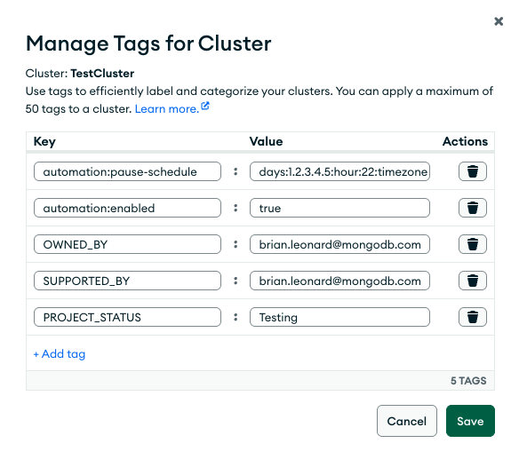

# MongoDB Atlas Cluster Automation V2

This project is the evolution of the original [Atlas Cluster Automation Using Scheduled Triggers](https://www.mongodb.com/developer/products/atlas/atlas-cluster-automation-using-scheduled-triggers/) published on MongoDB Developer. Version 2 builds on the scheduled trigger approach with a fully tag-based, serverless architecture for maximum transparency and zero infrastructure overhead. It provides automated pause scheduling for MongoDB Atlas clusters across multiple projects using Atlas cluster tags, helping optimize resource usage and reduce costs by automating the pausing of clusters when they're not needed.

## Architecture

This is a **serverless, infrastructure-free solution** built entirely on Atlas App Services. All schedule configuration is stored as tags directly on Atlas clusters, with no external databases or web UI required. The Atlas UI serves as the native interface for managing schedules. Optionally, activity logs can be stored in any MongoDB collection for audit purposes.


## Data Model

This solution uses a **serverless, tag-first approach**:

### Atlas Cluster Tags (Primary and Only Required Storage)
Schedule configuration is stored directly on Atlas clusters using tags:
```
Key: automation:pause-schedule
Value: days:1.2.3.4.5:hour:22:timezone:America-New_York
```

**Optional Automation Control:**
```
Key: automation:enabled  
Value: false (to disable automation, omit tag or use 'true' to enable)
```

**Tag Format Components:**
- `days:1.2.3.4.5` - Days of week (0=Sunday, 6=Saturday), dot-separated
- `hour:22` - Hour to pause (0-23, 24-hour format)
- `timezone:America-New_York` - IANA timezone (/ converted to - for Atlas compatibility)
- `automation:enabled` - Optional control tag (default: enabled if schedule exists)


### Optional Activity Logging
If audit trails are needed, activity logs can be stored in any MongoDB collection:
```javascript
{
  _id: ObjectId,
  projectId: String,
  clusterName: String,
  action: String,      // "pause", "resume", "configure"
  performedBy: String, // "SYSTEM_AUTOMATION_TRIGGER"
  timestamp: Date,
  details: Object      // Additional context about the action
}
```

## How Tag-Based Scheduling Works

### 1. Schedule Configuration (Multiple Options)


**Option A: Direct in Atlas UI**
- Navigate to your cluster → Configuration → Tags
- Add tag: `automation:pause-schedule` = `days:1.2.3.4.5:hour:22:timezone:America-New_York`
- Optionally add: `automation:enabled` = `false` (to temporarily disable automation)



**Option B: Using Atlas CLI**
```bash
# Add schedule tag to cluster
atlas clusters tags add <clusterName> --projectId <projectId> \
  --tag key=automation:pause-schedule,value=days:1.2.3.4.5:hour:22:timezone:America-New_York
```

### 2. Tag Creation
Any of the above methods creates an Atlas cluster tag:
```
Key: automation:pause-schedule
Value: days:1.2.3.4.5:hour:22:timezone:America-New_York

# Optional: Disable automation temporarily  
Key: automation:enabled
Value: false
```

### 3. Automated Processing
- Hourly trigger scans all Atlas projects for clusters with `automation:pause-schedule` tags
- **Checks `automation:enabled` tag** - skips clusters with `automation:enabled=false`
- Parses tag values to determine when clusters should be paused
- Converts schedule to local timezone and checks if current time matches
- Pauses clusters as needed and logs actions

### 4. Management & Visibility
- **Atlas UI**: Tags visible under cluster Configuration → Tags
- **Atlas CLI**: Use `atlas clusters tags list` to view schedules and automation status
- **App Services Logs**: View automation activity in App Services console
- **Activity Logs**: Optional MongoDB collection for detailed audit trail

## Automation Control

### Atlas UI 
1. Go to cluster → Configuration → Tags
2. Add tag: `automation:enabled` = `false` (to disable)
3. Remove the tag or set to `true` (to enable)


## Key Benefits

- **Zero Infrastructure:** No servers, databases, or web applications to maintain
- **Atlas-Native:** Fully integrated with Atlas UI, CLI, and API
- **Tag-Based Scheduling:** All configuration is stored as human-readable tags directly on clusters
- **Transparent:** Schedules and automation status are visible and manageable in the Atlas console
- **Secure by Default:** No custom authentication or web security concerns
- **Scalable:** Handles unlimited Atlas projects and clusters automatically
- **Cost-Effective:** Only pay for App Services execution time (typically pennies per month)
- **Self-Documenting:** Tag format is descriptive and version-controlled with cluster configuration
- **Timezone Support:** Configure schedules in any IANA timezone
- **Optional Logging:** Detailed audit trail for compliance and troubleshooting


## Atlas App Services Functions & Triggers

The application leverages MongoDB Atlas App Services for **tag-based automation**. Key functions and triggers include:

**Schedule Management:**
- `tags/setClusterScheduleTag`: Create/update schedule tags on clusters
- `tags/getClusterScheduleFromTags`: Retrieve schedule configuration from cluster tags
- `tags/parseScheduleTag`: Parse tag values into schedule objects
- `tags/removeClusterScheduleTag`: Remove schedule tags from clusters
- `tags/updateClusterTags`: Update cluster tags via Atlas API
- `dev/testScheduleTags`: Testing utility for tag operations

**Automation Control:**
- `automation/setClusterAutomationEnabled`: Enable/disable automation without removing schedule
- `automation/getClusterAutomationStatus`: Check automation and schedule status for a cluster
- `automation/setOrgWideSchedule`: Set default schedule for all clusters in organization (disabled by default)
- `automation/enableAutomationForProject`: Enable automation for all scheduled clusters in a project
- `automation/ensureDefaultTags`: Ensure clusters have required organizational tags with default values

**Project Discovery:**
- `atlas/getProjectsWithScheduledClusters`: Scan all Atlas projects for clusters with schedule tags (respects automation:enabled)

**Automation Triggers:**
- `trigger/processScheduledClusterOperations`: Tag-based cluster processing (runs hourly)
- `trigger/syncClusterStatus`: Updates cluster status for reporting (optional, for dashboard)

**Helper Functions:**
- `setClusterPauseState`: Pause or resume a specific cluster
- `modifyCluster`: Modify cluster attributes through Atlas API

**Collection Functions (for reporting/dashboard):**
- `collections/getClusterStatusCollection`: Get handle to the cluster status collection for reporting
- `collections/refreshClusterStatus`: Update reporting data from Atlas API + tags
- `collections/getActivityLogsCollection`: Get a handle to the activity_logs collection


## Quick Start Guide

### Prerequisites
- MongoDB Atlas account with clusters to automate
- Atlas Admin API key (public/private key pair)

### Setup (5-Minute Installation)

1. **Create Atlas App Services Application**
   ```bash
   # In your Atlas project, go to "App Services" and create a new application
   ```

2. **Configure API Credentials**
   - In App Services, go to Values & Secrets
   - Create secret `AtlasPrivateKeySecret` with your Atlas private API key
   - Create value `AtlasPublicKey` with your Atlas public API key

3. **Deploy the Functions**
   ```bash
   # Clone repository
   git clone https://github.com/wbleonard/atlas-cluster-automation-v2.git
   cd atlas-cluster-automation-v2
   
   # Install App Services CLI
   npm install -g atlas-app-services-cli
   
   # Login to Atlas
   appservices login --api-key="<Public Key>" --private-api-key="<Private Key>"
   
   # Deploy from app-services directory
   cd app-services/AutomationApp
   appservices push --remote="<Your App ID>"
   ```

4. **Add Dependencies**
   - In App Services console, go to Functions → Dependencies
   - Add: `moment-timezone`

5. **Configure Default Tags Enforcement (Optional)**
   - The system includes automatic tag enforcement that's disabled by default
   - In App Services console, go to Triggers → `ensureDefaultTagsTrigger`
   - Configure the schedule using cron format:
     - `0 0 * * 1` = Monday at midnight UTC (default)
     - `0 2 * * 0` = Sunday at 2 AM UTC  
     - `0 18 * * 5` = Friday at 6 PM UTC
     - `0 0 1 * *` = First day of every month at midnight
   - Enable the trigger when you're ready for automatic tag enforcement

6. **Test the Setup**
   ```javascript
   // In App Services console, run this test:
   await testScheduleTags("Hello world!", "", "set");
   ```

### Schedule Your First Cluster

**Option 1: Using App Services Console**
```javascript
// Set weekday 10 PM Eastern schedule
await setClusterScheduleTag("Hello world!", "", 22, [1,2,3,4,5], "America/New_York");
```

**Option 2: Using Atlas UI**
1. Go to your cluster → Configuration → Tags  
2. Add tag: `automation:pause-schedule` = `days:1.2.3.4.5:hour:22:timezone:America-New_York`

**Option 3: Using Atlas CLI**
```bash
atlas clusters tags add <clusterName> --projectId <projectId> \
  --tag key=automation:pause-schedule,value=days:1.2.3.4.5:hour:22:timezone:America-New_York
```

## Advanced Configuration

### Organization-Wide Setup
```javascript
// Set default schedule for ALL clusters in organization (disabled by default for safety)
await setOrgWideSchedule(22, [0,1,2,3,4,5,6], "America/New_York", false);

// Enable automation for specific project when ready
await enableAutomationForProject(projectId);

// Test org-wide setup
await testScheduleTags("Hello world!", "", "org-setup");

// Test project enablement
await testScheduleTags("Hello world!", "", "enable-project");
```

### Custom Timezones
```javascript
// Asia/Tokyo schedule
await setClusterScheduleTag(projectId, clusterName, 18, [1,2,3,4,5], "Asia/Tokyo");

// Europe/London schedule  
await setClusterScheduleTag(projectId, clusterName, 20, [0,6], "Europe/London");
```

### Weekend vs Weekday Schedules
```javascript
// Weekend morning shutdown
await setClusterScheduleTag(projectId, "dev-cluster", 9, [0,6], "America/New_York");

// Weekday evening shutdown
await setClusterScheduleTag(projectId, "prod-cluster", 22, [1,2,3,4,5], "America/New_York");
```

### Activity Logging Setup (Optional)
```javascript
// Configure activity logging collection
await getActivityLogsCollection(); // Sets up collection if needed
```

## Tag Format Reference

### Schedule Tag Format
```
Key: automation:pause-schedule
Value: days:1.2.3.4.5:hour:22:timezone:America-New_York
```

### Automation Control Tag Format
```
Key: automation:enabled
Value: false (to disable) | true (to enable) | omit tag (default: enabled)
```

**Schedule Components:**
- `days:` - Prefix for days of week section
- `1.2.3.4.5` - Days of week (0=Sunday through 6=Saturday), dot-separated
- `hour:` - Prefix for hour section  
- `22` - Hour to pause (0-23, 24-hour format)
- `timezone:` - Prefix for timezone section
- `America-New_York` - IANA timezone with `/` converted to `-` for Atlas compatibility

**Examples:**
- `days:1.2.3.4.5:hour:22:timezone:America-New_York` - Weekdays at 10 PM Eastern
- `days:0.6:hour:9:timezone:America-New_York` - Weekends at 9 AM Eastern  
- `days:1.3.5:hour:18:timezone:Europe-London` - Mon/Wed/Fri at 6 PM London time
- `days:1.2.3.4.5:hour:22` - Weekdays at 10 PM (defaults to America/New_York)

**Common Automation Control Scenarios:**
```bash
# Temporarily disable automation during maintenance
automation:enabled = false

# Production cluster - keep automation enabled (default)
# (no automation:enabled tag needed)

# Development cluster - enable automation  
automation:enabled = true
```

## Management & Monitoring

### View Schedules
```bash
# List all clusters with schedule tags
atlas clusters tags list --projectId <projectId>

# View specific cluster tags
atlas clusters describe <clusterName> --projectId <projectId>
```

### Monitor Automation
- **App Services Logs**: View function execution logs in Atlas App Services console
- **Atlas Activity Feed**: See cluster pause/resume events in Atlas project activity
- **Optional Activity Collection**: Query MongoDB collection for detailed audit trails

### Troubleshooting
```javascript
// Test tag parsing
await parseScheduleTag("days:1.2.3.4.5:hour:22:timezone:America-New_York");

// List all projects with scheduled clusters  
await getProjectsWithScheduledClusters();

// Test all tag operations
await testScheduleTags("Hello world!", "", "parse");

// Check automation status
await testScheduleTags("Hello world!", "", "status");

// Disable automation temporarily
await testScheduleTags("Hello world!", "", "disable");

// Re-enable automation
await testScheduleTags("Hello world!", "", "enable");
```

## Cost Optimization Examples

### Development Clusters
```
Tag: days:1.2.3.4.5:hour:18:timezone:America-New_York
Saves: ~70% on compute costs (paused 14 hours/day + weekends)
```

### Testing Clusters  
```
Tag: days:0.6:hour:22:timezone:America-New_York
Saves: ~50% on compute costs (paused nights + weekdays)
```

### Analytics Clusters
```
Tag: days:1.2.3.4.5:hour:23:timezone:America-New_York  
Saves: ~65% on compute costs (paused overnight + weekends)
```

## Contributing

Contributions are welcome! This solution is designed to be:
- **Simple**: Focused on core automation without unnecessary complexity
- **Secure**: No web UI or custom authentication to maintain  
- **Scalable**: Built on Atlas App Services serverless architecture
- **Transparent**: All configuration visible in Atlas UI

Please feel free to submit a Pull Request for improvements to the automation logic or additional scheduling features.

## License

This project is licensed under the MIT License - see the LICENSE file for details.